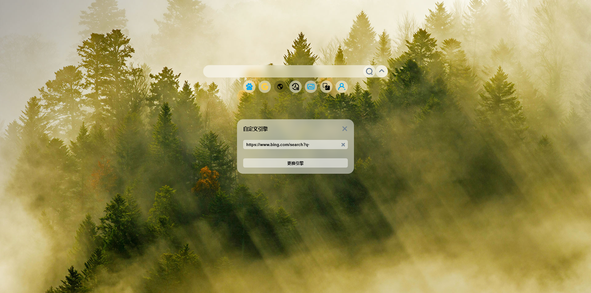
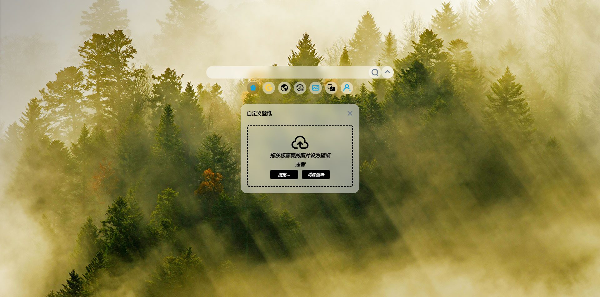
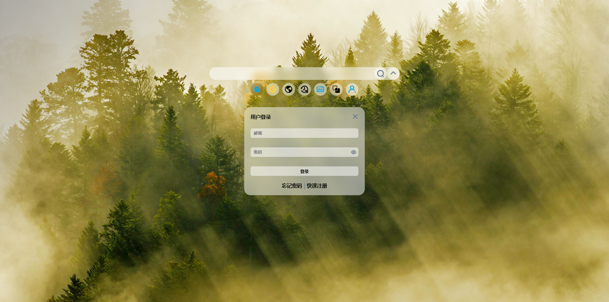
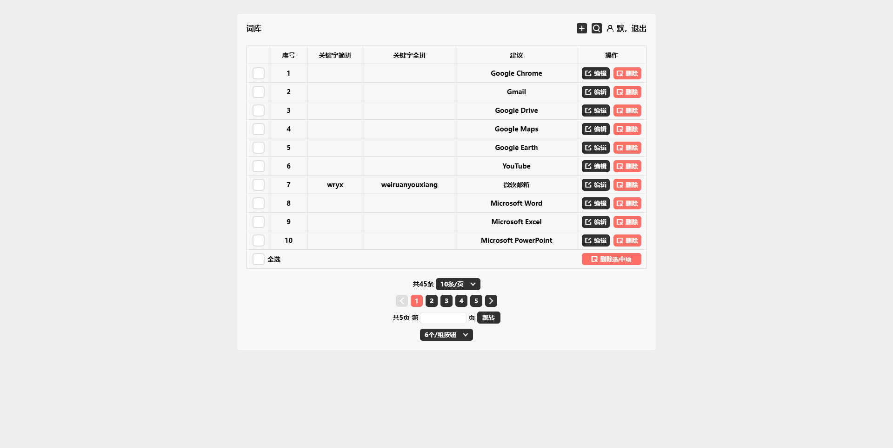
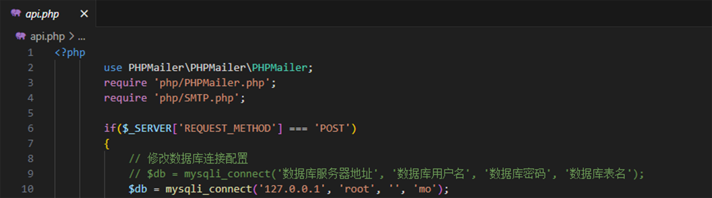
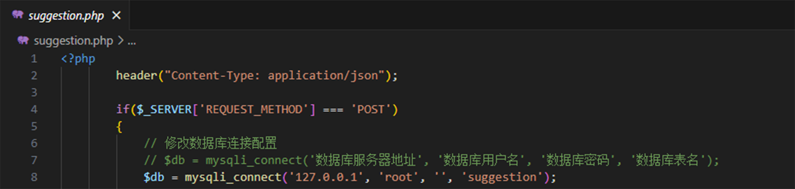
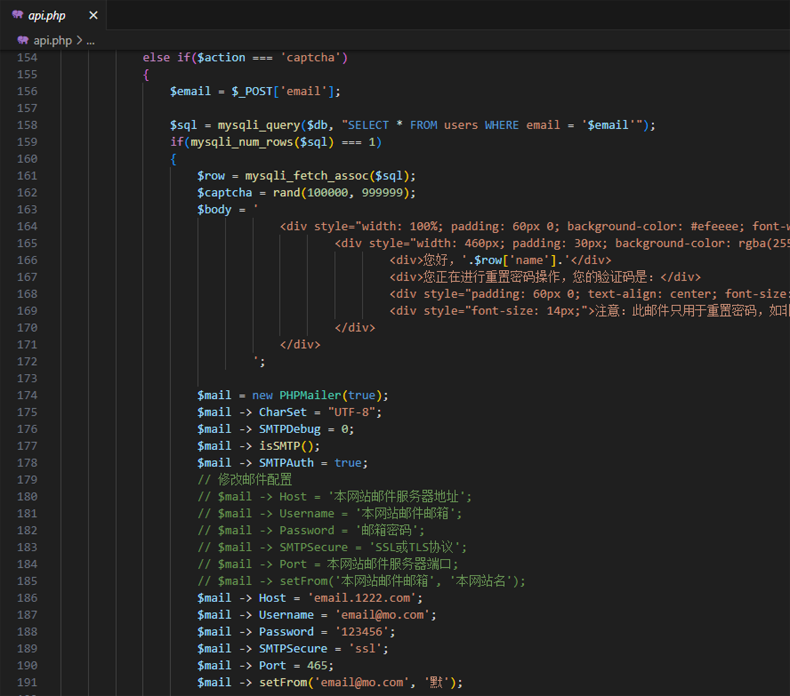

## 默
由默开发，简洁、美观、可自定义搜索引擎、可自定义壁纸、可收藏各种网站链接的浏览器起始页。
### 在线网址：https://wumo.cc
### 项目目录
默
 
├── css
 
│&emsp;&nbsp;&nbsp;├── style.css
 
│&emsp;&nbsp;&nbsp;└── suggestion.css
 
├── font
 
│&emsp;&nbsp;&nbsp;├── iconfont.ttf
 
│&emsp;&nbsp;&nbsp;├── iconfont.woff
 
│&emsp;&nbsp;&nbsp;└── iconfont.woff2
 
├── image
 
│&emsp;&nbsp;&nbsp;└── favicon.ico
 
├── js
 
│&emsp;&nbsp;&nbsp;├── jQuery-2.1.3.min.js
 
│&emsp;&nbsp;&nbsp;├── js.js
 
│&emsp;&nbsp;&nbsp;├── Sortable-1.15.0.min.js
 
│&emsp;&nbsp;&nbsp;└── suggestion.js
 
├── php
 
│&emsp;&nbsp;&nbsp;├── PHPMailer.php
 
│&emsp;&nbsp;&nbsp;└── SMTP.php
 
├── upload
 
├── .htaccess
 
├── 403.html
 
├── api.php
 
├── index.html
 
├── mo.sql
 
├── suggestion.html
 
├── suggestion.php
 
├── suggestion.sql
### 基于以下技术
HTML5：用于页面布局
 
CSS3：用于页面美化，适配手机端
 
JavaScript：用于页面事件
 
jQuery：用于数据请求
 
Sortable：用于网址快捷拖拽排序
 
PHP：用于登录、注册、忘记密码、发送邮件、注销账号、设置引擎、设置壁纸、添加或编辑网址快捷、网址快捷排序、图标获取、搜索建议词
 
MySQL：用于数据增、删、改、查

## 预览
### 搜索

### 设置

### 按钮功能
百度：用于百度搜索，可本地存储、后台存储
 
谷歌：用于谷歌搜索，可本地存储、后台存储
 
自定义引擎：用于自定义搜索引擎，如：必应（" https://www.bing.com/search?q= "），可本地存储、后台存储
 
搜索历史：用于搜索历史，可本地存储
 
自定义壁纸：用于自定义壁纸，可本地存储、后台存储
 
拖拽排序：用于网址快捷拖拽排序
 
用户登录：用于登录、注册、忘记密码、管理账号
### 自定义搜索引擎

### 自定义壁纸

### 登录

### 添加网址快捷

### 管理词库

## 修改配置
### PHP
### 数据库连接

### 发送邮件
